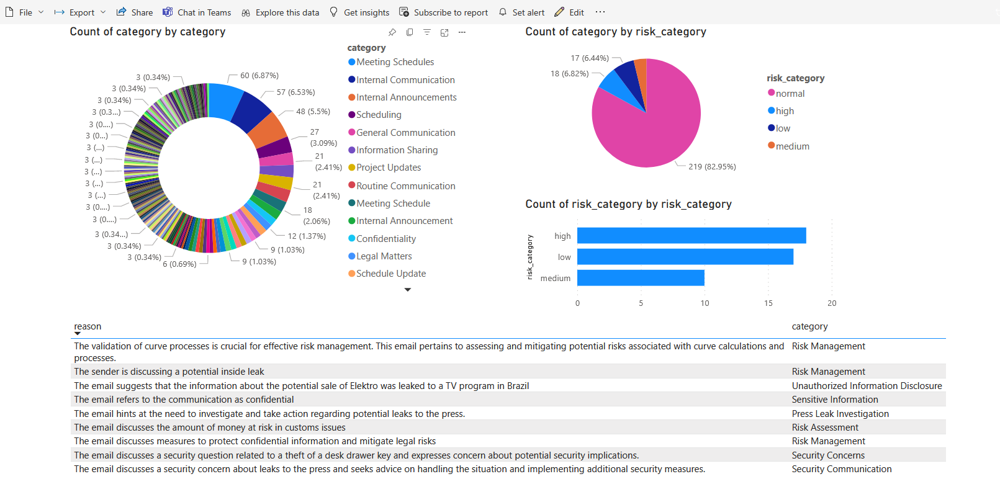

## Tracking Anomalies in Emails Datasets with Microsoft Fabric empowered with Azure OpenAI

#### End-to-End flow

#### Setup steps
<b>1. Loading Emails to Data Warehouse</b>

  - Data is loaded to Data Warehouse via Dataflow Gen2 from various sources, i.e. SQL DB, Web APIs, .csv files etc.

  - In our case as we are using Enron dataset, so we load data from .csv file to Data Warehouse.

  - This could be implemented to work on any email SQL DB and to load emails to SQL DB is possible using [Microsoft Power Automate tool](https://powerautomate.microsoft.com/en-us/templates/details/588f303807984a8faa2e075c887ca3c1/track-office-365-emails-in-an-sql-database/):
    - <i>With Microsoft Power Automate, you can create emails that are sent automatically when new data is added or when existing data is updated. Whenever you get a new email to your Office 365 address, track it in an SQL database table. You need to have a Table with Subject, From, CC, and ReceivedTime columns. </i>

  - We decided to use Data Warehouse, as having data in Data Warehouse gives opportunities to easily select subsets of emails to be analyzed with SQL querying, creating views which could be further used.

<b>2. Data preprocessing</b>

  - To preprocess data and prepare it for LLM model we exploit Dataflow Gen2 functionalities:
    - Combine data from various sources,
    - Remove unwanted columns,
    - Clean inputs, e.g., formatting of email addresses (this part could be used to anonymize users), etc.
  - All steps, including this one are part of the pipeline which could be either triggered periodically or manually.

<b>3. Exploiting Azure OpenAI APIs</b>

  - At this step we already loaded data to Lakehouse via Dataflow Gen2 (check the Pipeline)
  - We use Notebooks to connect to LLM, create RAG for semantic search and write prompts to LLM.
  - Results in form of structured data and summarized reports are stored in Lakehouse, which is further directly connected to Data Warehouse.

<b>4. PBI report</b>

  - We created a PBI report which is connecting to Data Warehouse result tables
  - This report shows updated results each time the Pipeline is triggered.

#### Dataset description:

To demonstrate how this solution is working we used Enron emails dataset available for free online.
The Enron email dataset contains approximately 500,000 emails generated by employees of the Enron Corporation. It was obtained by the Federal Energy Regulatory Commission during its investigation of Enron's collapse.
Detailed description is available at: https://www.cs.cmu.edu/~./enron/
Data can be downloaded at: https://www.cs.cmu.edu/~./enron/enron_mail_20150507.tar.gz

#### Pipeline preview:

#### PBI report example

Here is an example of how the results could be presented using PBI.

#### Workspace preview

